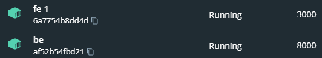
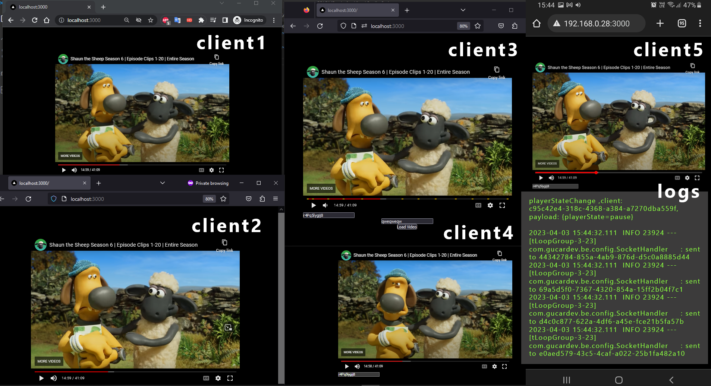

# Websocket Youtube Video Together Watching Project

## ! Project is still under the development process. Some features will be implement later.

&#x2611; video play/pause

&#x2611; video seeking

&#x2610; video playback rate change

&#x2610; video url change

&#x2610; sync with clients when joined to room 

&#x2610; Join room function 

&#x2610; chat

## How to run?

**First learn your local ip address on network:**

write your local ip address of your computer/host like `192.168.0.3`  to **.env file**

```bash
BACKEND_URL=http://<CHANGE_HERE>
BACKEND_PORT=8080
SOCKET_PORT=8000
```


**run this docker command:**

```bash
docker compose up --build -d
```

**Congrats! You can access to project by following address**

```bash
http://<YOUR_IP>:3000
```




## Examples




Example log of pause event:

```bash
2023-04-03 15:44:32.111  INFO 23924 --- [tLoopGroup-3-23] com.gucardev.be.config.SocketHandler     : playerStateChange ,client: c95c42e4-318c-4368-a384-a7270dba559f, payload: {playerState=pause}

2023-04-03 15:44:32.111  INFO 23924 --- [tLoopGroup-3-23] com.gucardev.be.config.SocketHandler     : sent to 44342784-855a-4ab9-876d-d5c0a8885d44 
2023-04-03 15:44:32.111  INFO 23924 --- [tLoopGroup-3-23] com.gucardev.be.config.SocketHandler     : sent to 69a5d5f0-7367-4320-854a-15ff2b04f7c1 
2023-04-03 15:44:32.111  INFO 23924 --- [tLoopGroup-3-23] com.gucardev.be.config.SocketHandler     : sent to d4c0c877-622a-4df6-a45e-fce21b5fa57b 
2023-04-03 15:44:32.111  INFO 23924 --- [tLoopGroup-3-23] com.gucardev.be.config.SocketHandler     : sent to e0aed579-43c5-4caf-a022-25b1fa482a10 
```
